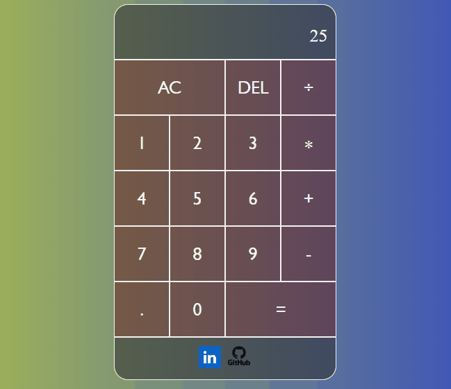

# Calculator

**Basic calculator design with using HTML, CSS and JavaScript**

_You can reach with_ [Calculator](https://feyizoglu.github.io/calculator/)

## JavaScript Part

In this project JS Class, Methods, DOM, Functions and Loops are used.

